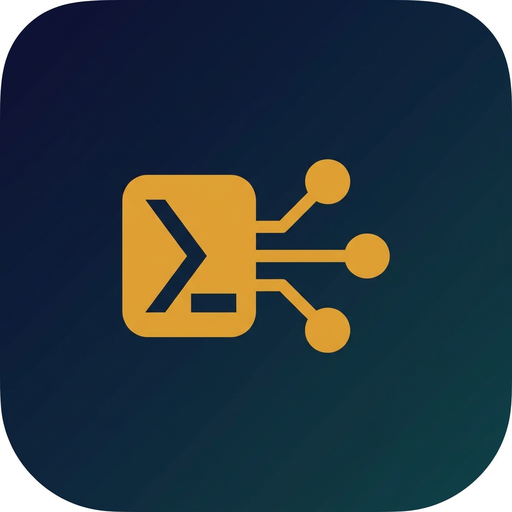

# Teraxlyst

A desktop workspace for AI coding agents. Tauri 2 + Rust + React.

**Status: 0.1.0-pre.** All M0-M6 scaffolds landed and validated in CI. M3.2 / M4.2 / M5.2 wireup landed. 28 tests passing. No tagged release yet; first will be 0.1.0 after the signing prerequisites in [`planning/SIGNING_PLAN.md`](./planning/SIGNING_PLAN.md) are in place.

  

## What's in this repository

- [`planning/README.md`](./planning/README.md) - what Teraxlyst is, what it isn't
- [`planning/ARCHITECTURE.md`](./planning/ARCHITECTURE.md) - stack decisions, data model, MCP host design
- [`planning/ROADMAP.md`](./planning/ROADMAP.md) - phased milestones M0-M6
- [`planning/FEATURE_MAP.md`](./planning/FEATURE_MAP.md) - nimbalyst feature -> Teraxlyst implementation table
- [`planning/CRITIQUE.md`](./planning/CRITIQUE.md) - self-review of the plan, open questions

## High-level design

Teraxlyst takes the Rust-and-Tauri shell from [terax-ai](https://github.com/crynta/terax-ai) (Apache-2.0, fork base v0.6.5) and rebuilds a focused subset of [nimbalyst](https://github.com/nimbalyst/nimbalyst)'s (MIT) workspace features on top of it:

- Multi-AI-session manager with live transcript streaming
- Visual red/green diff approval for agent file changes
- YAML-defined custom tracker system (Plans, Decisions, Bugs, Tasks, Ideas, Features, Automations)
- In-process MCP server (via official `rmcp` SDK) with structured PromptForUserInput widgets

Single binary, native systems integration, single-user in v1.

## Why not just use one of the upstream projects

- **terax-ai** is a terminal emulator with AI chat. Strong shell, light on workspace features.
- **nimbalyst** is an Electron + PGLite + Cloudflare stack with rich features and a collab server. Heavy, AGPL-licensed collab dependency.

Teraxlyst targets users who want nimbalyst's session-management and tracker workflow on top of a lighter, fully-permissive Rust stack.

## Licensing

- This repository: **Apache-2.0** (inherited from terax-ai upstream when the M0 fork lands).
- terax-ai: Apache-2.0, full attribution in [`NOTICE.md`](./NOTICE.md).
- nimbalyst: MIT, design-pattern inspiration only, no code reuse.

## Status by milestone

| Milestone | Status |
|-----------|--------|
| Planning docs | done |
| M0 fork + rebrand | done |
| M1 persistence | done (DbActor + 6 tables + 8 commands + 4 tests, all green in CI) |
| M2 multi-session manager | done (SessionManager + Claude Code subprocess + streaming + simple list view + 2 tests) |
| M3 MCP host | done (rmcp 1.7 + tool_router macro dispatcher + 3 tools + PromptForUserInputDialog mounted globally) |
| M4 trackers | done (5 tracker commands + YAML loader + TrackersPanel in sidebar) |
| M5 diff approval | done (DiffInbox in sidebar tab + Monaco diff viewer + diff_apply_and_resolve) |
| M6 0.1.0 release | docs (INSTALL.md + SIGNING_PLAN.md). Signing certs + keypair generation needed before tagged release |

See [`planning/ROADMAP.md`](./planning/ROADMAP.md) for details.

## Example trackers

Pre-built tracker YAMLs ship under [`examples/trackers/`](./examples/trackers/). Copy any of them to your workspace at `.teraxlyst/trackers/` to enable:

- `bugs.yaml` - bug reports with severity, status, tags
- `tasks.yaml` - generic tasks with priority and dependencies
- `decisions.yaml` - ADR-style architecture decisions
- `plans.yaml` - multi-phase initiatives with progress and milestones

See [`examples/trackers/README.md`](./examples/trackers/README.md) for the schema cheatsheet.

## Contributing

Issues and PRs welcome. See [CONTRIBUTING.md](./CONTRIBUTING.md) for the contributor workflow. Feedback on the plan goes in issues tagged `planning`.
